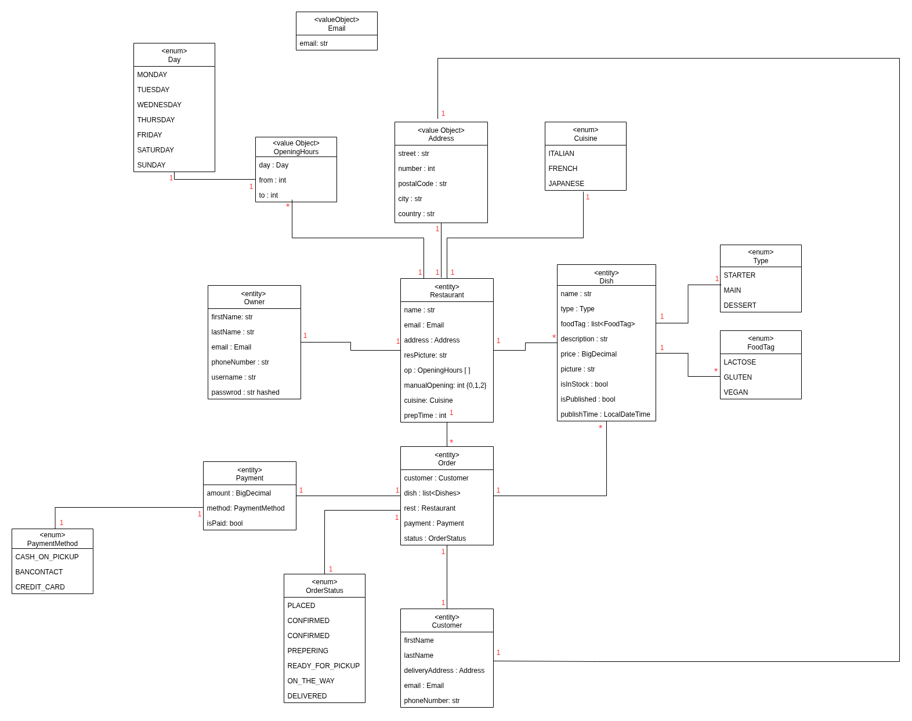

# Keep Dishes Going – Backend

## Description
Keep Dishes Going (KDG) is a food ordering platform where restaurant owners manage their menus and customers place and track orders.  
The backend ensures menus stay accurate, orders move smoothly from checkout to delivery, and updates from external services are processed in real time.  
It is built with **DDD**, **Hexagonal Architecture**, and **Event Sourcing** to keep the system modular, testable, and maintainable.

---

## Domain Model
  

---

## Technologies Used
- **Java + Spring Boot** – backend framework
- **PostgreSQL** – relational database
- **RabbitMQ** – messaging for incomingOrder and delivery events
- **Keycloak** – identity and access management
- **Docker Compose** – local development setup
- **Hexagonal Architecture (Ports & Adapters)** – clean separation of domain, application, and infrastructure layers

---
