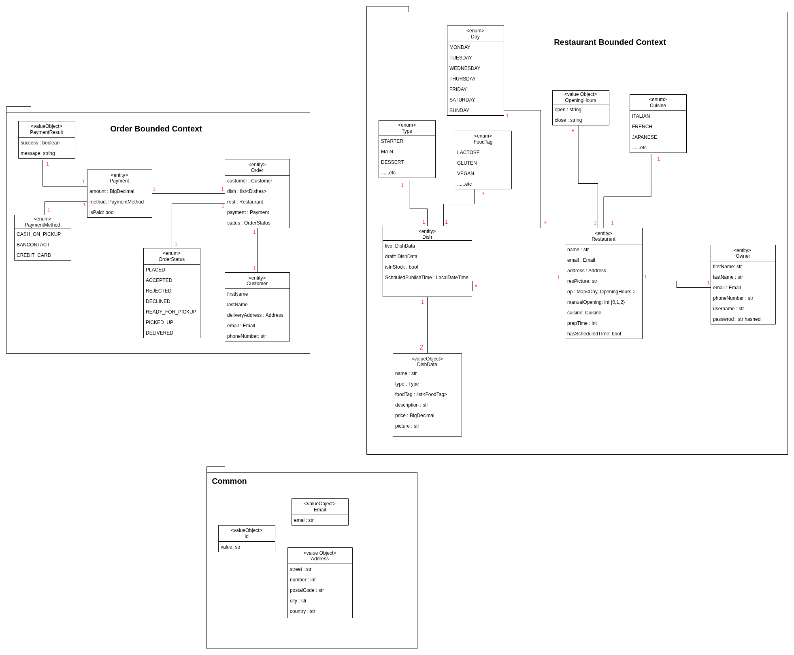

# Keep Dishes Going – Backend

## Description

Keep Dishes Going (KDG) is a food ordering platform where restaurant owners manage their dishes and customers place and
track orders.  
The backend ensures menus stay accurate, orders move smoothly from checkout to delivery, and updates from external
services are processed in real time.  
It is built with **DDD**, **Hexagonal Architecture**, and **Event Sourcing** to keep the system modular, and
maintainable.

---

## Domain Model

---

## Technologies Used

- **Java + Spring Boot**
- **PostgreSQL + JPA with Hibernate**
- **RabbitMQ**
- **Keycloak**
- **Docker Compose**
- **Hexagonal Architecture (Ports & Adapters)**

---

### Challenges & Accomplishments

* I faced many challenges during the development of the KDG application.

* I initially struggled to understand how to keep the Aggregate Root responsible for all tasks related to its domain.

* At first, in a use case where I published a dish, I did it directly in the use case (`dish.publish()`), but later I
  learned that such operations should be handled by the Aggregate Root (`restaurant.publishDish(dishId)`), aligning with
  hexagonal conventions in DDD.

* Understanding the RabbitMQ topology was also challenging;
  it was confusing at first, but I eventually grasped the concepts and how it works.

* The concepts I learned in this course gave me strong confidence in developing any kind of system, as they broadened my
  imagination and understanding of software architecture.

---

## ✅ Finished Features

- [x] Sign-up/Sign-in for a restaurant owner.
- [x] Creation of a restaurant.
- [x] Creation of a dish means creating a draft version, which needs to be published and set to IN_STOCK.
- [x] Editing a dish creates a draft version without affecting the live one.
- [x] Publishing a dish turns the draft version into a live, meaning the changes are updated to the live
- [x] Unpublishing a dish turns the live version into a draft, and if a draft already exists, the live version is
  discarded.
- [x] One action to make all dishes that have a draft version live (publish all).
- [x] Scheduling all dishes that have a draft version to a specific time to be published.
- [x] Mark a dish out of stock or back in stock immediately.
- [x] Manually open or close the restaurant at any moment, with three statuses: {AUTO: based on opening hours}, {OPEN:
  forces it open}, and {CLOSE: forces it closed}.
- [x] When an order is placed and the restaurant hexagon projects it, the owner can accept the order.
- [x] When an order is placed and the restaurant hexagon projects it, the owner can reject the order with a message.
- [x] If the restaurant does not respond within 5 minutes to a placed order, it will become DECLINED.
- [x] When an order is created, all dishes are checked to ensure they are from the same restaurant, that the restaurant
  is open, and that the dishes are IN_STOCK and PUBLISHED. Then, the order is created with PENDING_PAYMENT status.
- [x] Checkout status means the customer and payment info, are saved to the order. If all succeed, the order becomes
  PLACED and an event is sent to the restaurant.
- [x] Payment is mocked by checking if the payment token starts with 'tok_kdg' and verifying the payment amount.
- [x] The Order Hexagon listens to Order events [REJECTED, DECLINED, ACCEPTED, READY, PICKED_UP, DELIVERED], which are
  used for the order tracking feature.
- [x] All mentioned events are also projected by the restaurant, so the owner can react and see the status of an order.
- [x] No need for a customer to sign in or sign up — they can directly build a basket and checkout.
- [x] Each owner can only have one restaurant

---
